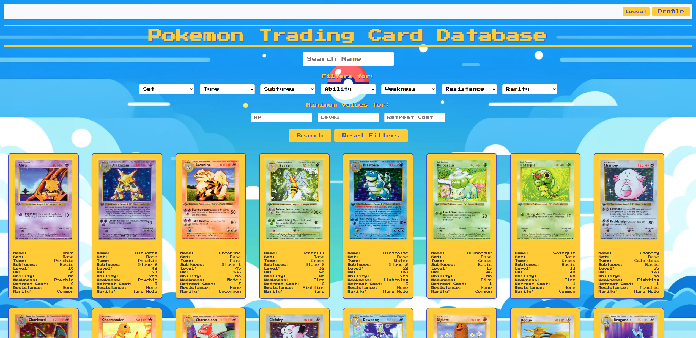
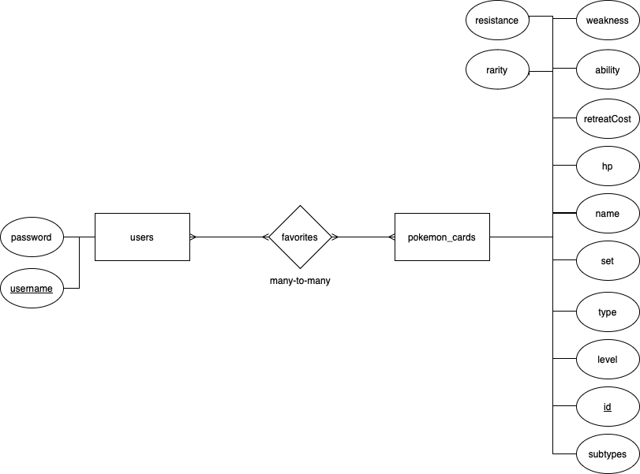

# Pokemon card database - track your favorite Pokemon trading cards! 

# running database project: 

Assumes a working Python 3 installation (with python=python3 and pip=pip3).

(1) Run the code below to install the dependencies.
>$ pip install -r requirements.txt

(2) Craete database (Call it whatever you want)

(3) Execute the SQL script 'Create_table.SQL' to create the required tables for the database. 

(4) Run Data.py to Import data from 'Project_data.csv' over to database \\
IMPORTANT: In Data.py change the file directory to the full path of the 'Project_data.csv' - file \\
IMPORTANT: In static folder unzip 'images.zip'

(5) In the 'App.py' - file, set your own database name, username, and password. 

(6) Run Web-App
>$ python src/App.py

----------------------------------------------------------------------------------------------

# How to use the application:

(1) Create account / You start by pressing the 'Register' button, you then get to page where you choose your username and password. ( When registering the first time you should be conneteced directly to step (3) )

(2) Login / Now you can login on your account by typing in your username and password.

(3) Frontpage / On the front page, you will find the entire database along with filtering options. Additionally, there are buttons for logging out and accessing your profile.

(4) Searching and filtering / On the front page, you can search for a specific Pokémon by name and filter by various attributes such as Set, Type, Subtypes, Ability, Weakness, Resistance, and Rarity. These filters are available as dropdown options to help you differentiate the Pokémon cards. Additionally, there are value filters for setting minimum values for HP, Level, and Retreat Cost. Once you have selected your desired filters, simply click the "Search" button to update the database with the corresponding filters. If you wish to reset the filters and start over, you can click the "Reset Filters" button.

(5) Pokemon cards / Each Pokémon card can be clicked on to access its dedicated webpage, where you can favorite the specific Pokémon.

(6) Profile / Each user has their own individual page where they can view their favorite Pokémon cards.

---------------------------------------------------------------------------------------------

#E/R diagram of Pokemon card database

